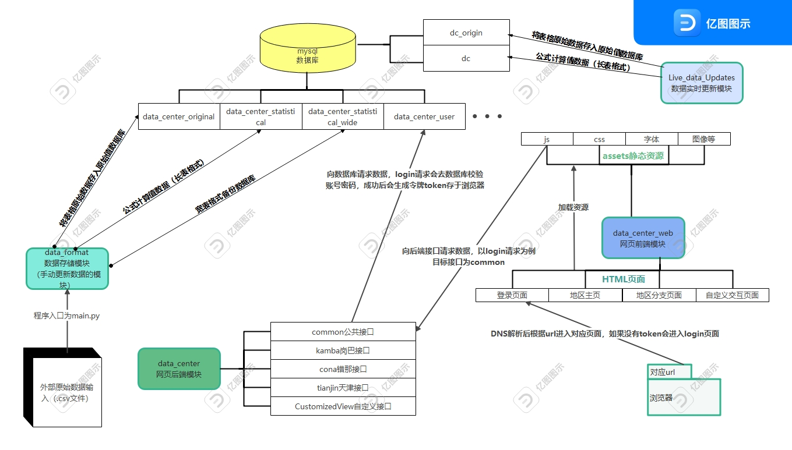

### 一. 项目整体结构图

</img>

### 二. 本地搭建前端与后端开发环境
1. 前期准备：请检查本地环境中的mysql（5.7.24），git，python3, django等软件是否安装，推荐下载一个数据库工具如navicat来辅助查看数据库表。

    teams上所在的软件开发团队的文件中，有你需要的公司各个系统的账号密码，请下载后保存，后面会频繁使用。

2. 准备一个新文件夹，克隆后端模块和前端模块代码以及数据更新模块代码
    ~~~
    1. 拉取/克隆后端代码
    git clone  https://github.com/qiruijiudian/data_center.git

    2. 拉取/克隆前端代码
    git clone https://github.com/qiruijiudian/data_center_web.git

    3. data_format模块代码
    git clone https://github.com/qiruijiudian/data_format.git

    4.LiveDataUpdates模块代码
    git clone https://github.com/qiruijiudian/LiveDataUpdates.git
    ~~~
    具体启动操作在每个模块里的readme中都有包含，遵照操作流程即可，建议先看下面的注意事项再进行操作。

3. 下面是一些注意事项：
    ~~~
    1.项目中的python依赖库都是linux环境的依赖库版本，与windows环境的依赖库版本不同，请不要将本地的配置文件requirement.txt提交至代码库。具体版本详见各个模块的readme.md文件。

    2.启动之后访问网页会弹出登录界面，但是这时候你无法登录（因为你的数据库是空的），账户的位置在云服务器数据库的data_center_user库的user表中。
    你可以同步云上数据库内容至本地数据库，也可以将后端setting.py文件中的user数据库ip指向云服务器ip.

    3.本地环境请使用浏览器的无痕模式打开目标网页，否则可能仍然出现2中无法登录的情况。

    4.由于这时你的本地数据库还没有数据，登录之后的图表无法显示数据，需要使用数据导入模块更新数据(见步骤三)。
    ~~~

4. 如何切换数据来源

    data_center的目录中下，settings.py中有一个TESTOPTION选项，这个选项决定了你的后端数据从哪个数据库取数据。

        (1)TESTOPTION = True -> 数据源为data_center_statistical，对应的数据导入模块为data_format
        (2)TESTOPTION = Flase -> 数据源为dc，对应的数据导入模块为LiveDataUpdates

### 三. 使用数据导入模块更新数据
1. data_format模块和LiveDataUpdates模块都是用于数据更新，区别在于
    ~~~
    (1).data_format与LiveDataUpdates更新的目标数据库表不同（详情见项目流程图）
    (2).LiveDataUpdates模块数据来源为施耐德的云服务器接口，data_format需要手工引入csv数据文件
    ~~~

2. 测试，导入之前，需要把本地数据库的结构调整为和云服务器一致，否则会有很多不必要的报错。这里推荐使用navicat工具中的结构同步功能，一键同步云服务器的数据库结构至本地数据库。也可以将建表语句复制后在本地执行。
    ~~~
    不推荐将数据和结构一起同步，原因是云服务器上数据表太过庞大，同步数据需要数个小时。
    ~~~
    具体启动操作在每个模块里的readme中都有包含，遵照操作流程即可，建议先看下面的注意事项再进行操作。启动脚本之前检查配置文件setting.py对应的数据库ip，不要导入错数据库。

3. data_format模块注意事项：
    ~~~
    1.如果不存在/data_format/data/data/kamba目录, 请手动创建该文件夹，这个路径是程序对kamba原始宽表数据.csv文件的读取目录

    2.将需要更新的数据文件(一般是.csv格式)放入/data_format/data/data/kamba目录,执行成功后该目录下文件.csv会删除，所以请在别的位置保留好数据备份。

    3. 执行主函数时加上history参数，走更新历史数据的代码分支。（更新实时数据的分支有bug还未解决）
    更新历史数据(csv导入)：
    python main.py history
    ~~~

4. LiveDataUpdates模块注意事项：
    ~~~
    1.更新前一定要查看目标源数据库（dc_origin）的数据日期与当前日期的时间间隔，如果大于7天，导入后的结果会出现异常。
    这时请手动修改live_data_update.py中
    OriginLiveDataUpdates(False, True).update_realtime_data()
    函数的时间参数，以7天为周期分割导入至当前实时日期。

    2.目前官网数据平台的数据源为LiveDataUpdates模块，导入的数据库为dc，如无必要不要切换官网数据平台的数据源。
    ~~~

### 四. 对云服务器上代码的更新
1. 云服务器上有超时断开连接的规则，请不要在打开文件的情况下闲置。
2. 云服务器上的python服务都是持久化运行的，可以使用
    ~~~
    ps -ef | grep py
    ~~~
    命令查看正在运行的python服务。
3. 进入/home/目录下对应的模块进行git pull拉取最新代码的操作，python会自动重启。
如果网页端没有反馈请清除浏览器cookie后重试。
4. 如果拉取代码出现bug导致官网出问题，可以按照以下步骤还原
    ~~~
    git reflog // 查看代码pull的历史记录
    git reset --hard {commit id} //回滚版本
    ~~~
5. 考虑到云服务器内存与安全问题，请不要直接在服务器上做开发动作。